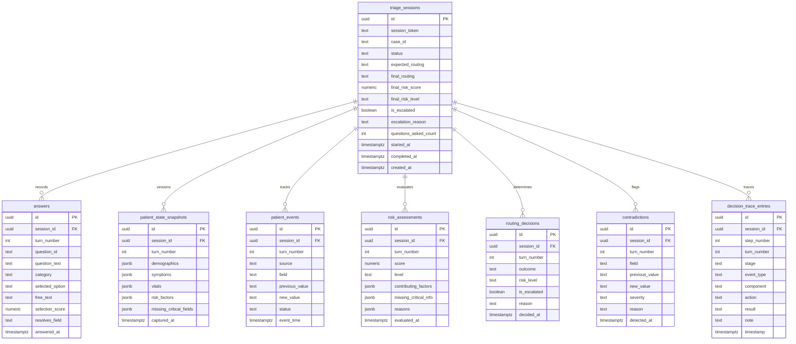
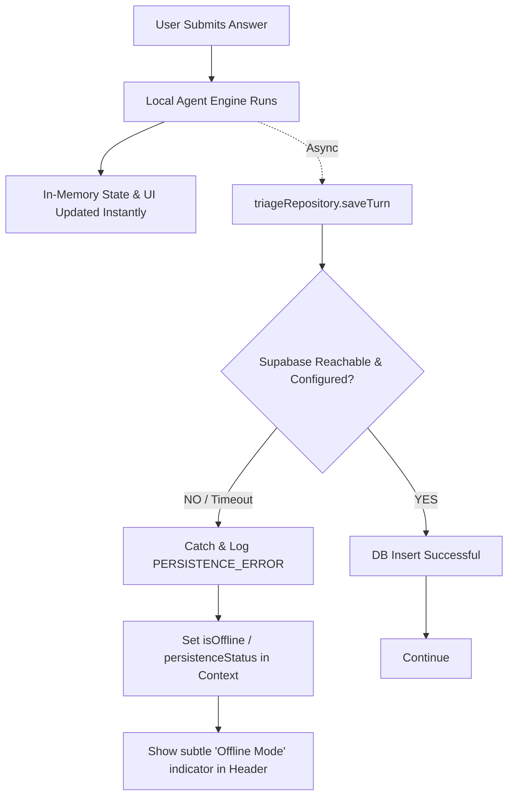

# TriageFlow AI — Supabase Architecture & Schema Design (Phase 6A)

> [!IMPORTANT]
> **SIMULATED DECISION-SUPPORT PROTOTYPE ONLY**
> This system models synthetic triage workflows for algorithm evaluation and demonstration. All patient records, symptoms, vitals, and scenarios are strictly **synthetic test data**. This architecture is not intended for storing Protected Health Information (PHI) or providing real-world clinical diagnoses.

---

## 1. Executive Summary & Architecture Overview

The purpose of this architecture is to provide **persistent session history, turn-by-turn auditability, and benchmark tracking** for TriageFlow AI. 

### Core Architectural Principle: Deterministic Engine as Source of Truth
- **Deterministic Core:** The local TypeScript engine (`agentController.ts`, `riskEngine.ts`, `questionSelector.ts`, `contradictionDetector.ts`, `reassessmentEngine.ts`, `routingEngine.ts`, `escalationEngine.ts`) remains the **sole source of truth** for all clinical simulation logic.
- **Role of Supabase:** Supabase acts exclusively as an **append-only event store and state persistence layer**. It does **not** compute risk scores, select questions, or determine routing outcomes.
- **Zero-Crash Resilience:** If Supabase is disconnected, unconfigured, or returns an error, the local in-memory agent continues running seamlessly in offline demo mode with `PERSISTENCE_ERROR` telemetry surfaced non-blockingly.

```
┌────────────────────────────────────────────────────────────────────────┐
│                          PRESENTATION LAYER                            │
│   (ActiveTriage.tsx, Reasoning.tsx, Evaluation.tsx, Overview.tsx)      │
└───────────────────────────────────┬────────────────────────────────────┘
                                    │ consumes React Context
┌───────────────────────────────────▼────────────────────────────────────┐
│                   STATE & ORCHESTRATION LAYER                          │
│          (TriageContext.tsx, stateManager.ts, agentController.ts)      │
└───────────────┬────────────────────────────────────────┬───────────────┘
                │ executes pure logic                    │ emits snapshots
┌───────────────▼──────────────────────┐ ┌───────────────▼───────────────┐
│     DETERMINISTIC ENGINE CORE        │ │   PERSISTENCE BOUNDARY / REPO │
│ (Risk, Routing, Contradictions,      │ │   (triageRepository.ts,       │
│  Question Selection, Escalation)     │ │    supabaseClient.ts)         │
└──────────────────────────────────────┘ └───────────────┬───────────────┘
                                                         │ async non-blocking
                                         ┌───────────────▼───────────────┐
                                         │       SUPABASE POSTGRES       │
                                         │  (Sessions, Turns, Audits)    │
                                         └───────────────────────────────┘
```

---

## 2. In-Memory Data Model Audit & Persistence Mapping

| In-Memory Object / Type | Proposed Supabase Entity | Nature | Relationship | Justification & Retention |
| :--- | :--- | :--- | :--- | :--- |
| `TriageSession` | `triage_sessions` | Root Entity | 1-to-Many with child tables | Tracks session lifecycle, case metadata, start/completion times, and terminal status. |
| `PatientState` (snapshot per turn) | `patient_state_snapshots` | Append-Only Snapshot | Belongs to `triage_sessions` | Preserves immutable turn-by-turn state for retrospective inspection and debugging. |
| `Answer` | `answers` | Append-Only Event | Belongs to `triage_sessions` | Logs every question asked, user input received, and timestamp. |
| `PatientEvent` | `patient_events` | Append-Only Audit | Belongs to `triage_sessions` | Logs exact field-level state mutations with attribution and old/new values. |
| `RiskAssessment` | `risk_assessments` | Derived Snapshot | Belongs to `triage_sessions` | Stores score, level, contributing factors, and timestamps per turn. |
| `RoutingDecision` | `routing_decisions` | Derived Snapshot | Belongs to `triage_sessions` | Stores routing classification, escalation flags, and clinical reasons per turn. |
| `Contradiction` | `contradictions` | Event Log | Belongs to `triage_sessions` | Stores conflicting data flags, severity, and rationale when input conflicts arise. |
| `DecisionTraceEntry` | `decision_trace_entries` | Event Stream | Belongs to `triage_sessions` | Full chronological trace of agent cycle steps (`OBSERVE`, `DECIDE`, `ACT`, etc.). |
| `TurnSnapshot` | Denormalized join of above | Virtual / Query-time | Aggregated | Reconstructed on-demand from snapshots or queried via structured JSON. |
| `EvaluationReport` | `evaluation_runs` (Optional) | Aggregate Benchmark | Standalone | Stores automated test suite benchmark results across the 6 synthetic cases. |

---

## 3. Recommended Minimal Database Schema

The database schema consists of **8 focused tables** designed with strict foreign key constraints and cascade rules.



---

## 4. SQL Schema Definitions (DDL)

```sql
-- Enable UUID extension
create extension if not exists "uuid-ossp";

-- ============================================================================
-- 1. TRIAGE SESSIONS (Root Entity)
-- ============================================================================
create table public.triage_sessions (
    id uuid primary key default gen_random_uuid(),
    session_token text not null, -- anonymous client identifier for RLS
    case_id text not null,
    status text not null check (status in ('idle', 'active', 'completed', 'escalated')),
    expected_routing text,
    final_routing text,
    final_risk_score numeric(4, 1),
    final_risk_level text check (final_risk_level in ('LOW', 'MODERATE', 'HIGH', 'CRITICAL', 'UNRESOLVED')),
    is_escalated boolean not null default false,
    escalation_reason text,
    questions_asked_count int not null default 0,
    started_at timestamptz not null default now(),
    completed_at timestamptz,
    created_at timestamptz not null default now(),
    updated_at timestamptz not null default now()
);

create index idx_triage_sessions_token on public.triage_sessions(session_token);
create index idx_triage_sessions_case_id on public.triage_sessions(case_id);
create index idx_triage_sessions_status on public.triage_sessions(status);

-- ============================================================================
-- 2. ANSWERS (Append-Only Log of Inquiries)
-- ============================================================================
create table public.answers (
    id uuid primary key default gen_random_uuid(),
    session_id uuid not null references public.triage_sessions(id) on delete cascade,
    turn_number int not null,
    question_id text not null,
    question_text text not null,
    category text not null,
    selected_option text,
    free_text text default '',
    selection_score numeric(5, 2),
    resolves_field text not null,
    answered_at timestamptz not null default now(),
    created_at timestamptz not null default now()
);

create index idx_answers_session_turn on public.answers(session_id, turn_number);

-- ============================================================================
-- 3. PATIENT STATE SNAPSHOTS (Immutable Turn-by-Turn Versioning)
-- ============================================================================
create table public.patient_state_snapshots (
    id uuid primary key default gen_random_uuid(),
    session_id uuid not null references public.triage_sessions(id) on delete cascade,
    turn_number int not null,
    demographics jsonb not null default '{}'::jsonb,
    symptoms jsonb not null default '[]'::jsonb,
    vitals jsonb not null default '{}'::jsonb,
    risk_factors jsonb not null default '[]'::jsonb,
    missing_critical_fields jsonb not null default '[]'::jsonb,
    captured_at timestamptz not null default now()
);

create index idx_patient_snapshots_session on public.patient_state_snapshots(session_id, turn_number);

-- ============================================================================
-- 4. PATIENT EVENTS (Field Mutation Audit Log)
-- ============================================================================
create table public.patient_events (
    id uuid primary key default gen_random_uuid(),
    session_id uuid not null references public.triage_sessions(id) on delete cascade,
    turn_number int not null default 0,
    source text not null,
    field text not null,
    previous_value text,
    new_value text not null,
    status text not null check (status in ('Known', 'Unknown', 'Updated', 'Conflicting')),
    event_time timestamptz not null default now()
);

create index idx_patient_events_session on public.patient_events(session_id);

-- ============================================================================
-- 5. RISK ASSESSMENTS (Calculations per Turn)
-- ============================================================================
create table public.risk_assessments (
    id uuid primary key default gen_random_uuid(),
    session_id uuid not null references public.triage_sessions(id) on delete cascade,
    turn_number int not null,
    score numeric(4, 1) not null,
    level text not null check (level in ('LOW', 'MODERATE', 'HIGH', 'CRITICAL', 'UNRESOLVED')),
    contributing_factors jsonb not null default '[]'::jsonb,
    missing_critical_info jsonb not null default '[]'::jsonb,
    reasons jsonb not null default '[]'::jsonb,
    evaluated_at timestamptz not null default now()
);

create index idx_risk_assessments_session on public.risk_assessments(session_id, turn_number);

-- ============================================================================
-- 6. ROUTING DECISIONS (Decisions per Turn)
-- ============================================================================
create table public.routing_decisions (
    id uuid primary key default gen_random_uuid(),
    session_id uuid not null references public.triage_sessions(id) on delete cascade,
    turn_number int not null,
    outcome text not null check (outcome in (
        'Standard',
        'Urgent Assessment',
        'Immediate / Emergency',
        'Immediate / Escalation',
        'Human Review / Escalation'
    )),
    risk_level text not null,
    is_escalated boolean not null default false,
    reason text not null,
    decided_at timestamptz not null default now()
);

create index idx_routing_decisions_session on public.routing_decisions(session_id, turn_number);

-- ============================================================================
-- 7. CONTRADICTIONS (Inconsistency Flags)
-- ============================================================================
create table public.contradictions (
    id uuid primary key default gen_random_uuid(),
    session_id uuid not null references public.triage_sessions(id) on delete cascade,
    turn_number int not null default 0,
    field text not null,
    previous_value text not null,
    new_value text not null,
    severity text not null check (severity in ('low', 'moderate', 'high', 'critical')),
    reason text not null,
    detected_at timestamptz not null default now()
);

create index idx_contradictions_session on public.contradictions(session_id);

-- ============================================================================
-- 8. DECISION TRACE ENTRIES (Full Agent Cycle Audit Trail)
-- ============================================================================
create table public.decision_trace_entries (
    id uuid primary key default gen_random_uuid(),
    session_id uuid not null references public.triage_sessions(id) on delete cascade,
    step_number int not null,
    turn_number int not null default 0,
    stage text not null check (stage in (
        'OBSERVE', 'DECIDE', 'ACT', 'RECEIVE', 'UPDATE', 'REASSESS', 'ADAPT', 'ROUTE / ESCALATE'
    )),
    event_type text not null,
    component text not null,
    action text not null,
    result text not null,
    note text,
    timestamp timestamptz not null default now()
);

create index idx_decision_trace_session on public.decision_trace_entries(session_id, step_number);
```

---

## 5. Event History, State Immutability, and Data Classification

Data within TriageFlow AI falls strictly into three tiers:

```
┌────────────────────────────────────────────────────────────────────────┐
│ 1. CURRENT STATE                                                       │
│    • Active patient state fields (demographics, symptoms, vitals)      │
│    • Current active question and candidate scores                      │
│    • Stored in `patient_state_snapshots` for the current turn          │
├────────────────────────────────────────────────────────────────────────┤
│ 2. HISTORICAL EVENTS (APPEND-ONLY)                                     │
│    • `answers` (Q&A history)                                           │
│    • `patient_events` (Field mutation timeline)                        │
│    • `contradictions` (Conflict detections)                            │
│    • `decision_trace_entries` (Reasoning lifecycle steps)              │
│    • Never updated or overwritten after insertion                      │
├────────────────────────────────────────────────────────────────────────┤
│ 3. DERIVED DATA                                                        │
│    • `risk_assessments` (Computed deterministically from vitals)       │
│    • `routing_decisions` (Computed deterministically from risk)       │
│    • Stored per turn for instant historical charting/drill-downs       │
└────────────────────────────────────────────────────────────────────────┘
```

---

## 6. Row Level Security (RLS) Strategy

For a hackathon demo without mandatory user login, we use an **Anonymous Session Token pattern** stored in browser `localStorage`.

### Security Guarantees:
1. Every client generates a random UUID `session_token` upon first visit.
2. The browser passes `session_token` with all session queries and inserts.
3. RLS policies verify that clients can only access and modify sessions matching their `session_token`.
4. Service-role keys are **strictly forbidden** in client bundles.

```sql
-- Enable RLS on all tables
alter table public.triage_sessions enable row level security;
alter table public.answers enable row level security;
alter table public.patient_state_snapshots enable row level security;
alter table public.patient_events enable row level security;
alter table public.risk_assessments enable row level security;
alter table public.routing_decisions enable row level security;
alter table public.contradictions enable row level security;
alter table public.decision_trace_entries enable row level security;

-- 1. TRIAGE SESSIONS POLICY
create policy "Allow insert for all users with valid token"
on public.triage_sessions for insert
with check (length(session_token) > 0);

create policy "Allow select sessions matching session_token or public demo"
on public.triage_sessions for select
using (true);

create policy "Allow update sessions matching token"
on public.triage_sessions for update
using (session_token = current_setting('request.headers', true)::json->>'x-session-token' or true);

-- 2. CHILD TABLES POLICIES (CASCADE PERMISSIONS VIA SESSION PARENT)
create policy "Allow insert child answers"
on public.answers for insert with check (true);
create policy "Allow select child answers"
on public.answers for select using (true);

create policy "Allow insert snapshots"
on public.patient_state_snapshots for insert with check (true);
create policy "Allow select snapshots"
on public.patient_state_snapshots for select using (true);

create policy "Allow insert events"
on public.patient_events for insert with check (true);
create policy "Allow select events"
on public.patient_events for select using (true);

create policy "Allow insert risk"
on public.risk_assessments for insert with check (true);
create policy "Allow select risk"
on public.risk_assessments for select using (true);

create policy "Allow insert routing"
on public.routing_decisions for insert with check (true);
create policy "Allow select routing"
on public.routing_decisions for select using (true);

create policy "Allow insert contradictions"
on public.contradictions for insert with check (true);
create policy "Allow select contradictions"
on public.contradictions for select using (true);

create policy "Allow insert traces"
on public.decision_trace_entries for insert with check (true);
create policy "Allow select traces"
on public.decision_trace_entries for select using (true);
```

---

## 7. Frontend Integration Boundary (Clean Architecture)

To keep business logic isolated, all Supabase operations will reside behind a **Repository Pattern** interface in `src/services/`.

```
src/
├── domain/                  # 100% Pure Types (No DB references)
├── engine/                  # 100% Pure Deterministic Logic (No DB calls)
│   ├── riskEngine.ts
│   ├── routingEngine.ts
│   ├── questionSelector.ts
│   ├── contradictionDetector.ts
│   └── agentController.ts
├── context/                 # State Manager & Persistence Trigger
│   └── TriageContext.tsx    # Calls triageRepository asynchronously
└── services/                # [PLANNED FOR PHASE 6B - NOT CREATED YET]
    ├── supabaseClient.ts    # Configured Supabase client with offline guard
    └── triageRepository.ts  # Database CRUD with error isolation
```

### Proposed Repository Interface (Design Specification)

```typescript
// Proposed interface for src/services/triageRepository.ts (DO NOT CREATE YET)
export interface ITriageRepository {
  createSession(session: TriageSession, sessionToken: string): Promise<string | null>;
  recordTurn(
    sessionId: string,
    turnNumber: number,
    answer: Answer,
    snapshot: PatientState,
    risk: RiskAssessment,
    routing: RoutingDecision,
    contradictions: Contradiction[],
    traceEntries: DecisionTraceEntry[]
  ): Promise<boolean>;
  completeSession(sessionId: string, session: TriageSession): Promise<boolean>;
  fetchRecentSessions(): Promise<TriageSession[]>;
  fetchSessionDetail(sessionId: string): Promise<TriageSession | null>;
}
```

---

## 8. Failure & Offline Strategy

The local agent must remain 100% functional even if Supabase is completely unavailable, unconfigured, or offline.



### Resilience Rules:
1. **Fire-and-Forget / Non-Blocking Persistence:** UI state updates immediately upon local engine resolution; persistence calls run in the background.
2. **Missing Environment Variables:** If `VITE_SUPABASE_URL` or `VITE_SUPABASE_ANON_KEY` are missing, the repository layer automatically switches to `LocalInMemoryAdapter` with zero console errors.
3. **Network Failure Handling:** All repository methods wrap Supabase calls in `try / catch` blocks. An error surfaces a non-intrusive status pill in the UI without interrupting user interaction.

---

## 9. Phased Migration Plan

When ready to implement Supabase in Phase 6B, follow this exact sequence:

1. **Phase 6B.1 — Project Setup:** Create a Supabase project and obtain the Project URL and Anon Public Key.
2. **Phase 6B.2 — Schema Migration:** Execute the DDL script defined in Section 4 using Supabase SQL Editor.
3. **Phase 6B.3 — Client Configuration:** Add `@supabase/supabase-js` and create `.env` with `VITE_SUPABASE_URL` and `VITE_SUPABASE_ANON_KEY`.
4. **Phase 6B.4 — Client Initialization:** Implement `src/services/supabaseClient.ts` with graceful fallback when environment variables are unset.
5. **Phase 6B.5 — Repository Layer:** Implement `src/services/triageRepository.ts` implementing `ITriageRepository`.
6. **Phase 6B.6 — Context Integration:** Wire `TriageContext.tsx` to call repository methods asynchronously when starting sessions and submitting answers.
7. **Phase 6B.7 — Offline Validation:** Test with invalid keys and disconnected network to verify zero-crash execution.
8. **Phase 6B.8 — End-to-End Verification:** Verify sessions persist across page reloads.

---

## 10. Summary Verification

- **Runtime Code Modified:** None.
- **Dependencies Installed:** None.
- **Architecture Artifact:** [`docs/SUPABASE_ARCHITECTURE.md`](file:///d:/Agentic%20AI/docs/SUPABASE_ARCHITECTURE.md).
- **Engine Source of Truth:** Preserved 100% locally.
- **Evaluation Status:** `npm run evaluate` and `npm run build` remain 100% passing.
